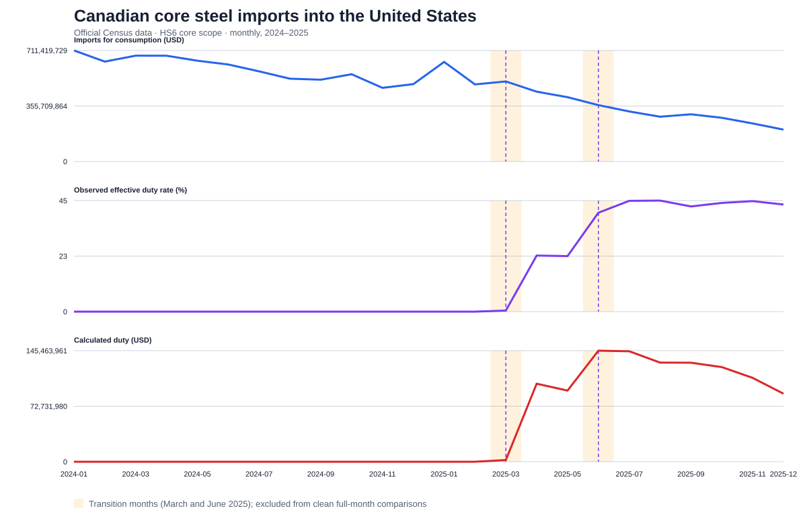

# Canada-U.S. Trade Shock Observatory: Initial Release

[](https://github.com/ridoy-roy/canada-us-trade-shock-observatory/actions/workflows/tests.yml)

**Ridoy Roy | Data Analyst**

**Independent Portfolio Project**

Reproducible, audit-oriented release for the 2025 U.S. Section 232 shock to
Canadian **core steel** imports. The pipeline ingests monthly U.S. imports for consumption
at HTS10, preserves exact Census responses, maps HTS10 to HS6, attaches the
policy regime, validates the panel, and produces publication-ready tables,
charts, and a report. It does not contain a dashboard.

## Published release

- **[Read the six-page analytical report](output/pdf/canada_us_trade_shock_observatory_v0.pdf)**
- [Explore the portfolio notebook](notebooks/initial_release_walkthrough.ipynb)
- [Read the detailed Markdown report](reports/v0_release_report.md)
- [Open the validated monthly summary](data/processed/core_steel_monthly_summary.csv)
- [Review the release validation results](data/processed/release_validation_report.json)

The scoped value of Canadian core-steel imports fell from $7.13 billion in
2024 to $4.51 billion in 2025, a 36.8% decline. Calculated duty rose from zero
to $1.07 billion. These are descriptive results, not causal estimates.



The product-level decomposition identifies zinc-coated flat-rolled steel (HS6
`721049`) and welded rectangular steel tube (HS6 `730661`) as the two largest
contributors to the annual value decline. See the
[top-10 contribution table](data/processed/top_10_hs6_decline_contributors.csv)
and [chart](artifacts/top_10_hs6_decline_contributors.svg).

## About the analyst

Ridoy Roy is a data analyst focused on turning public data into transparent,
reproducible evidence. This project demonstrates data ingestion, validation,
policy-date modeling, product-code harmonization, statistical summary,
visualization, and research communication.

## Scope

- Flow: U.S. imports for consumption from Canada (`CTY_CODE=1220`).
- Period: January 2024–December 2025 for the full release; January–December
  2025 for the HTS10 pilot.
- Product scope: core steel ranges in Proclamation 9705, not later derivative
  articles. The machine-readable ranges are in
  `config/core_steel_hs6_ranges.csv`.
- Pilot: HTS10 `7208101500`, mapped to HS6 `720810`.
- Outcomes: monthly customs value, first quantity, dutiable value, and
  calculated duty from the Census International Trade API.

## Quick start

Python 3.11+ is sufficient; the initial release deliberately has no third-party runtime
dependencies.

```powershell
python -m venv .venv
.venv\Scripts\Activate.ps1
$env:PYTHONPATH = "$PWD\src"
$env:CENSUS_API_KEY = "your Census API key"
python scripts/build_v0_panel.py
python -m unittest discover -s tests -v
```

Alternatively, put the key after `CENSUS_API_KEY=` in the Git-ignored `.env`
file. The build reads that file automatically and never writes the key into raw
snapshot metadata.

An editable install (`python -m pip install -e .`) is optional when the local
environment already provides a recent `setuptools`; the `PYTHONPATH` workflow
above works without downloading packaging tools.

The live build writes:

- `data/raw/census_imports_hs/YYYY-MM/*.json`: exact response bytes, named by
  content hash;
- adjacent `*.metadata.json`: retrieval time, public request parameters, hash,
  and byte count (the API key is never written);
- `data/processed/trade_policy_panel.csv`;
- `data/processed/validation_report.json`;
- `artifacts/pilot_7208101500_monthly.svg`.

## Full analytical release

After the pilot succeeds, build the complete official 2024–2025 core-steel
release:

```powershell
python scripts/build_release.py
```

This enumerates the product scope from the January 2025 Census commodity
concordance and fetches official HS6 total rows for four chapter prefixes. It
produces:

- `core_steel_product_universe_2025.csv` — 746 HTS10 lines / 168 HS6 codes;
- `core_steel_hs6_monthly_panel.csv` — product-month observations;
- `core_steel_monthly_summary.csv` — 24 aggregate monthly observations;
- `release_validation_report.json` — coverage and quality results;
- `artifacts/core_steel_2024_2025_monthly.svg`;
- `reports/v0_release_report.md`.
- `top_10_hs6_decline_contributors.csv` and its SVG chart;
- `notebooks/initial_release_walkthrough.ipynb` — a portfolio-oriented analysis walkthrough.

Rebuild deterministically from the 96 saved API snapshots without network
calls using `python scripts/build_release.py --reuse-snapshots`.

Quantity is unavailable in Census HS6 aggregate responses and is represented
as null, never zero. The HTS10 pilot retains its valid reported quantity unit.

All Census API data calls now require a key. Request one from the
[Census API key page](https://api.census.gov/data/key_signup.html). The official
monthly merchandise archives are a no-key fallback, but they are large fixed-
width ZIP files; this project uses the much narrower official API path.

### Offline contract build

To verify the repository without credentials or network access:

```powershell
python scripts/build_v0_panel.py --source fixture
```

The fixture values are intentionally synthetic and exist only to test the
official response contract and transformations. Outputs from this mode carry
`"source_mode": "fixture"` in the validation report and must not be published
as observed trade data.

## Treatment design

The additional Section 232 rate is encoded at daily resolution:

| Entry date | Additional rate for scoped Canadian core steel |
|---|---:|
| Before 2025-03-12 | 0% |
| 2025-03-12 through 2025-06-03 | 25% |
| From 2025-06-04 | 50% |

March and June are transition months. Each row includes the rate on the first
and last day, a calendar-day-weighted descriptive rate, and a clean-month rate.
The clean-month rate is null for both transition months and
`include_clean_month_analysis` is false. The weighted rate does **not** claim
that entries were evenly distributed across days.

The observed effective duty rate is `calculated duty / imports for
consumption`. It is not expected to equal the Section 232 rate because
calculated duty can include ordinary duties and because entry treatment,
programs, exclusions, and timing can differ.

## Reproducibility and validation

Snapshots are append-only and content-addressed. Re-fetching identical bytes is
idempotent; revised bytes create a new file rather than overwriting history.
The build fails on malformed Census responses, negative measures, duplicate
panel keys, missing expected months, non-Canada observations, products outside
the encoded core-steel scope, inconsistent quantity units, or incorrect
transition flags.

Run a partial live pull with, for example:

```powershell
python scripts/build_v0_panel.py --months 2025-01 2025-02
```

GitHub Actions runs the complete unit-test suite on every push and pull request.
To work through the analysis interactively, install the optional notebook tools
with `python -m pip install -e ".[analysis]"` and open
`notebooks/initial_release_walkthrough.ipynb`.

## Official sources

- [Census monthly imports by HS API](https://api.census.gov/data/timeseries/intltrade/imports/hs.html)
- [Census API variable definitions](https://api.census.gov/data/timeseries/intltrade/imports/hs/variables.html)
- [Census Schedule C country codes](https://www.census.gov/foreign-trade/schedules/c/countrycodes.html)
- [February 2025 steel proclamation](https://www.whitehouse.gov/presidential-actions/2025/02/adjusting-imports-of-steel-into-the-united-states/)
- [June 2025 steel and aluminum proclamation](https://www.whitehouse.gov/presidential-actions/2025/06/adjusting-imports-of-aluminum-and-steel-into-the-united-states/)
- [Census merchandise import archives](https://www.census.gov/foreign-trade/data/IMDB.html)
- [Census fixed-width import layouts](https://www.census.gov/foreign-trade/reference/products/layouts/imdb.html)

## Publishing this repository

The repository is ready for a public GitHub release. The API key, raw Census
responses, local environments, and temporary render files are excluded by
`.gitignore`; validated processed datasets, charts, reports, and source code are
included. See [PUBLISHING.md](PUBLISHING.md) for the short upload workflow.

## Next steps

1. Run the live build with a Census key and review the snapshot metadata and
   validation report.
2. Replace the pilot list with a versioned, line-level 2025 HTS inclusion table
   verified against the operative Chapter 99 notes.
3. Add HTS-vintage concordances before extending the panel across years.
4. Add comparison products/countries and pre-period data for causal designs.
5. Reconcile calculated duty against applicable Chapter 99 entry treatment.
6. Add Parquet and a data catalog once the observation universe expands.
